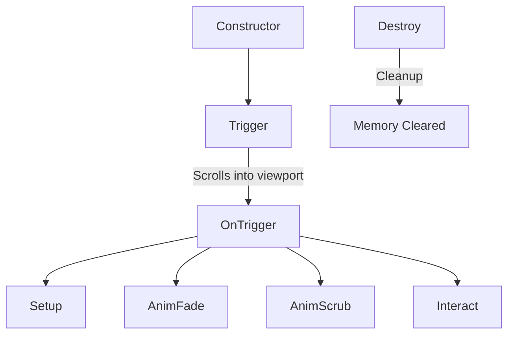

# Standard GSAP Section Animation Guide

This document defines the standard architecture for implementing section-specific JavaScript animations in this codebase. By inheriting from `TriggerSetup`, we ensure that animations are **lazy-initialized** (only initialized when scrolled near the viewport), which guarantees optimal performance and prevents unnecessary resource consumption.

---

## 1. Class Lifecycle Blueprint

Each section module follows a strict lifecycle divided into six major phases:



### Methods Overview

1. **`constructor()`**
   - Initialize instance variables (`this.el`, timers, splits, timelines, event handlers) to `null` or empty arrays. Do not query the DOM here.
2. **`trigger(data)`**
   - Query the main wrapper element. If it exists, call `super.setTrigger(this.el, this.onTrigger.bind(this))` to defer initialization until the section is close to viewport entry.
3. **`onTrigger()`**
   - Called automatically by `TriggerSetup` when the element is scrolled into view. Triggers the core methods in order: `setup()`, `animFade()`, `animScrub()`, and `interact()`.
4. **`setup()`**
   - Prepares DOM states: split texts, initial transformations, CSS properties, etc.
5. **`animFade()`**
   - Sets up autonomous, play-once, or auto-playing animations (such as text rotation loops or entrance fade-ins) that do *not* depend on scroll-scrubbing.
6. **`animScrub()`**
   - Sets up scroll-linked timelines (scrubbing) where GSAP properties are directly bound to the user's scroll progress (e.g., parallax effects, sticky rotations).
7. **`interact()`**
   - Sets up user-driven interactive events, such as tab click handlers, mouse hover events, or form interactive behaviors.
8. **`destroy()`**
   - Crucial for single-page performance. Clean up interactive event listeners, kill timelines, clear intervals/timeouts, revert SplitTexts, and call `super.cleanTrigger()`.

---

## 2. Code Template (Standard Blueprint)

Use the following blueprint when creating a new section module:

```javascript
SectionName: class extends TriggerSetup {
  constructor() {
    super();
    this.el = null;
    this.fadeTl = null;
    this.scrubTl = null;
    this.splits = [];
    this.timer = null;
    this.tabClickHandler = null;
  }

  // 1. Hook into DOM and set up lazy-scroll detection
  trigger(data) {
    this.el = document.querySelector('.my_section_wrap');
    if (!this.el) return;
    super.setTrigger(this.el, this.onTrigger.bind(this));
  }

  // 2. Main lifecycle driver
  onTrigger() {
    this.setup();
    this.animFade();
    this.animScrub();
    this.interact();
  }

  // 3. Prepare elements and apply initial values
  setup() {
    const title = this.el.querySelector('.my_section_title');
    if (title) {
      const split = new SplitText(title, { type: 'chars' });
      gsap.set(split.chars, { yPercent: 100 });
      this.splits.push(split);
    }
  }

  // 4. Autonomous entry animations / loops
  animFade() {
    const chars = this.splits[0]?.chars;
    if (chars) {
      this.fadeTl = gsap.timeline();
      this.fadeTl.to(chars, {
        yPercent: 0,
        duration: 0.8,
        ease: 'power2.out',
        stagger: 0.03
      });
    }
  }

  // 5. Scroll-linked animations (scrubbing)
  animScrub() {
    const bgImage = this.el.querySelector('.my_section_bg img');
    const decoElement = this.el.querySelector('.my_section_deco');

    this.scrubTl = gsap.timeline({
      scrollTrigger: {
        trigger: this.el, // Trigger is the scroll-wrapper
        start: 'top top',
        end: 'bottom bottom',
        scrub: 1,
        invalidateOnRefresh: true
      }
    });

    if (bgImage) {
      this.scrubTl.to(bgImage, {
        scale: 1.1,
        yPercent: 10,
        ease: 'none'
      }, 0);
    }

    if (decoElement) {
      this.scrubTl.to(decoElement, {
        rotation: 180,
        ease: 'none'
      }, 0);
    }
  }

  // 6. User interactive events (tabs, hover, clicks, form validations)
  interact() {
    this.tabClickHandler = function () {
      if ($(this).hasClass('active')) return;
      $('.tab_item').removeClass('active');
      $(this).addClass('active');
    };
    $('.tab_item').on('click', this.tabClickHandler);
  }

  // 7. Complete memory cleanup
  destroy() {
    super.cleanTrigger();

    if (this.tabClickHandler) {
      $('.tab_item').off('click', this.tabClickHandler);
    }
    
    if (this.timer) {
      clearInterval(this.timer);
      this.timer = null;
    }
    
    if (this.fadeTl) {
      this.fadeTl.kill();
      this.fadeTl = null;
    }
    
    if (this.scrubTl) {
      this.scrubTl.kill();
      this.scrubTl = null;
    }

    this.splits.forEach(split => {
      if (split) split.revert();
    });
    this.splits = [];
  }
}
```
